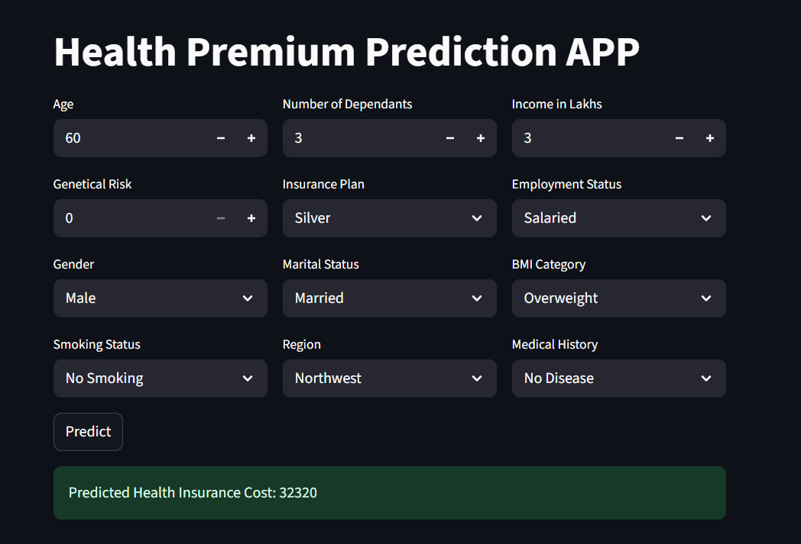

# 🏥 Health Premium Prediction App

This is a **Streamlit-based web application** that predicts a user's **health insurance premium cost** based on demographic, medical, and lifestyle information.  
It provides an interactive interface where users can input their details and receive a **predicted premium cost** instantly.

---

## 📸 App Demo


---
## 🚀 Features
- Collects user details such as:
  - Age, Dependants, Income
  - Insurance Plan & Employment Status
  - Gender, Marital Status, BMI Category
  - Smoking Habits & Region
  - Medical History & Genetical Risk
- Clean UI with **4 rows of input fields** arranged neatly in columns.
- Predicts premium using a trained ML model (via `predit_helper.py`).
- Displays results instantly.

---

## 📂 Project Structure
```
├── app/
│   ├── main.py              # Streamlit app (this file)
│   ├── predit_helper.py     # Contains predict() function
│   ├── artifacts/           # Trained model files (joblib/pickle)
│
├── README.md                # Project documentation
├── requirements.txt         # Python dependencies
```

---

## ⚙️ Installation & Setup

### 1️⃣ Clone the repository
```bash
git clone https://github.com/sumitjoshi10/Healthcare-Premium-Prediction.git
cd health-premium-prediction
```

### 2️⃣ Create a virtual environment (optional but recommended)
```bash
python -m venv venv
source venv/bin/activate   # On Mac/Linux
venv\Scripts\activate      # On Windows
```

### 3️⃣ Install dependencies
```bash
pip install -r requirements.txt
```

### 4️⃣ Run the app
```bash
streamlit run app/main.py
```

---

## 🧠 Model Details
- The model is stored in `artifacts/` and loaded via `predit_helper.py`.
- `predit_helper.py` should implement:
  ```python
  def predict(input_dict):
      # Preprocess inputs
      # Load trained model
      # Return prediction
  ```

---

## 🤝 Contributing
Contributions are welcome!  
1. Fork the repo  
2. Create a new branch (`feature/new-feature`)  
3. Commit your changes  
4. Push and open a PR  

---
